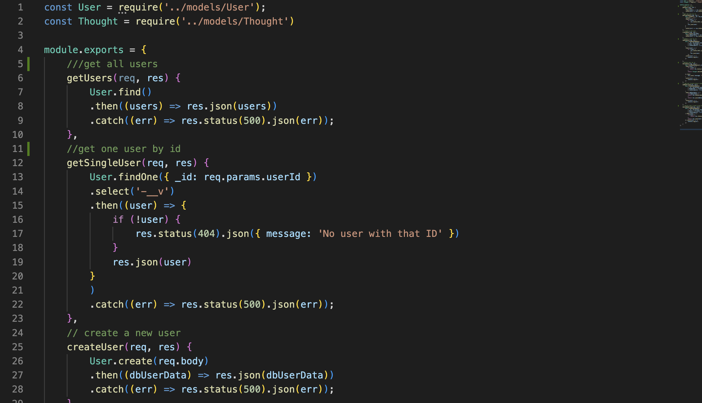

# NoSQL-Social-Network-API

## Description

This is the backend for a social network application that uses Mongoose and Express to build a NoSQL API. Through this backend one is able to create users, add friends, write thoughts for each user, and react to thoughts. They are also able to update and delete thoughts and users, as well as delete friends and reactions. If a user is deleted their thoughts will be deleted as well.

## License

Click the badge above for more information on this license!

## Table of Contents

- [Installation](#installation)
- [Usage](#usage)
- [Questions](#questions)
- [Link to Walkthrough Video](#link-to-walkthrough-video)

## Installation

If you clone this repository you will need to run an NPM install to install your dependencies. After just run npm run start"" and you are ready to go.

## Usage

See below for a walkthrough demonstration of each route made using Insomnia.

## Link to Walkthrough Video

[Click here to view the walkthrough video!](https://drive.google.com/file/d/1XrmSjpfHXBU_jmhYQUm3Vkuobl3nSBSV/view)

If you follow this link you can view a video guiding you through this backend.

## Questions

If you have any further questions for me you can contact me through my email as seen below. 

[Click here for my Github!](https://github.com/msaylorphila)
[Click here to Email me!](mailto:saylor.margaret@gmail.com)